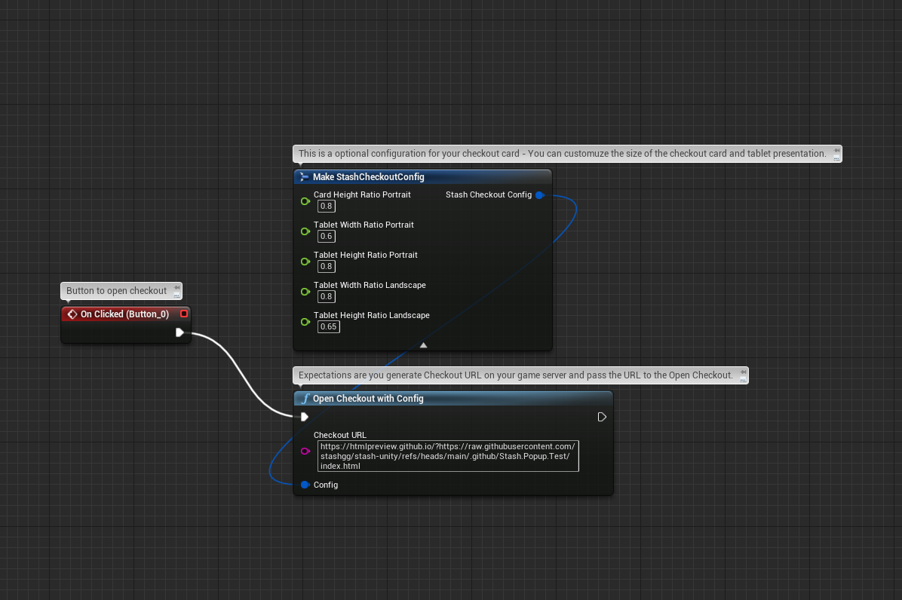
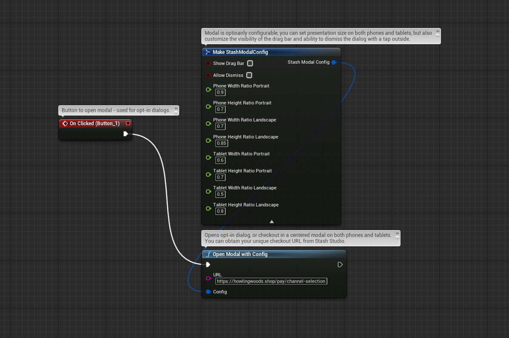

# Stash for Unreal Engine 5

<p align="left">
  
</p>

Unreal Engine plugin wrapper for [stash-native](https://github.com/stashgg/stash-native), enabling Stash Pay IAP checkout and webshop presentation on Android and iOS via C++ and Blueprints. The plugin uses **Stash Native** (**2.2.3**).

## Requirements

- Unreal Engine 5.0+ (sample project targets **5.7**)
- iOS 12.0+ / Android API 21+
- Xcode (iOS), Visual Studio (Windows/Android), Android SDK (Android)

## Sample / Downloads

### Run the sample

1. Clone this repo and open **`StashUnreal5.uproject`** in Unreal Engine 5.
2. In the Content Browser, open **`Content/StashUnrealSample/Maps/Stash_SampleScene`**.
3. Press **Play**. The level spawns **`WBP_StashUI`** — the demo widget with Open Card, Open Modal, Open Browser, optional keep-alive, Android checkout backdrop capture, and **Get Stash Subsystem** callbacks.
4. To inspect or copy the wiring, open **`Content/StashUnrealSample/Blueprints/WBP_StashUI`** in the Widget Blueprint editor (hover Stash nodes/pins for tooltips).

The sample keep-alive config uses the example notification icon **`stash_icon`**, shipped under **`StashUnrealSample/Android/res/drawable/`** (copied into the APK by **`StashUnreal5_UPL_Android.xml`** — not part of the Stash plugin).

### Use in your project

Copy the **`Plugins/Stash/`** folder into your project’s **`Plugins/`** directory and enable the plugin under **Edit → Plugins → Mobile → Stash**.

**Editor checkout preview (optional):** If your Unreal Engine build includes the **Web Browser** plugin, enable it under **Edit → Plugins → Web Browser**, rebuild the editor, then use **Window → Stash Preview**. The project does **not** require Web Browser to open — Stash mobile builds are unaffected.

## Unreal Editor Preview

The plugin includes an editor-only checkout preview (similar to [stash-unity’s editor simulator](https://github.com/stashgg/stash-unity)). Test Stash Pay card, modal, and browser flows on Windows/macOS without deploying to a device.

### Setup

1. Enable **Stash** under **Edit → Plugins**, then restart the editor.
2. **Optional (preview webview):** If **Web Browser** appears in the plugin list, enable it, rebuild, and restart.
3. Open **Window → Stash Preview** (dock tab on the right).
4. Optional: **Edit → Project Settings → Plugins → Stash** — toggle **Enable Editor Preview**, browser mode, default device preset, **Show Device Chrome**, and the Custom device platform/size.

### Device presets & platform emulation

The preview device dropdown covers **iOS and Android phones and tablets**: iPhone SE / 14 / 14 Pro / 14 Pro Max, iPad, iPad Pro, Pixel 8, Galaxy S24, Pixel Tablet, Galaxy Tab S9, plus Custom (platform and size from Project Settings). Each preset carries its **platform, safe-area insets, notch/punch-hole style, and keyboard heights**, and the panel shows the physical resolution (e.g. `@3x → 1179 x 2556 px`).

Selecting a preset switches platform **behavior**, not just the frame:

- **Android:** **Close Browser** becomes a no-op (Chrome Custom Tabs cannot be closed by the app — a warning is logged, matching device), the **Back (Android)** button (or **Esc** while the panel is focused) simulates the back gesture (hides the keyboard first, then dismisses — blocked while processing or when `bAllowDismiss` is off), and the keep-alive APIs render a **notification mock** over the browser preview.
- **iOS:** Close Browser closes the session (Safari View Controller parity); there is no back gesture.

**Safe areas & device chrome:** the frame renders a bezel, status bar, notch / Dynamic Island / punch-hole, and home indicator / gesture bar per preset (toggle with **Show device chrome**). Layout respects insets like the native SDK: the bottom-drawer card's web content sits above the home indicator / gesture bar (sheet background fills the inset zone), card expand stops below the status bar, and centered sheets center within the safe area.

**Keyboard simulation:** focusing an input field in the checkout page shows a platform-styled soft-keyboard mock (numeric fields get the number pad). The webview viewport shrinks like `visualViewport` / `adjustResize`, the focused field scrolls into view, bottom-drawer cards get covered by the keyboard (as on device) while centered modals shift up. Use the **Show/Hide keyboard** button to test without focusing a field.

### Usage

When **Enable Editor Preview** is on, calls to **Open Card**, **Open Modal**, and related APIs during **Play-In-Editor** are intercepted and shown in the preview panel with a phone-sized webview, dim overlay, and card/modal chrome driven by your Blueprint config.

**Config-driven layout:** The preview reads `FStashCardConfig` / `FStashModalConfig` from each open call and applies native-aligned sizing:

- **Card (phone):** bottom drawer — full width × `CardHeightRatioPortrait` in portrait; `CardWidthRatioLandscape` × `CardHeightRatioLandscape` in landscape.
- **Card (tablet):** iPad / iPad Pro presets (or Custom when max dimension ≥ 768) use `TabletWidth/HeightRatio*` and a **centered** sheet, not a bottom drawer.
- **Card `bForcePortrait`:** portrait ratios even if the preview device is landscape; landscape toggle is disabled while the card is open.
- **Modal:** phone or tablet ratio sets; always **centered** (both width and height from config — unlike card, phone modal is never full-bleed width). `bAllowDismiss` — tap the dim overlay to dismiss (unless purchase is processing).
- **`BackgroundColor`:** visible as the rounded sheet shell behind the webview (drag handle on **card** only; modal is a centered dialog without the card swipe handle).
- **`AndroidCheckoutBackdrop`:** rendered behind the dim overlay.

The **Active config** block in the preview controls panel shows which ratio fields are active, applied pixel size, flags, and shell color. Pick a device preset that matches the ratios you want to verify (e.g. **iPad Pro** + landscape toggle for tablet modal ratios; **iPhone** portrait uses `PhoneWidthRatioPortrait` × `PhoneHeightRatioPortrait`).

**Dismiss in preview:** drag the sheet handle downward (card only), tap the dim overlay (modal when `bAllowDismiss`), or use the **Dismiss** button in the controls panel.

**Expand card in preview:** drag the sheet handle upward on phone bottom-drawer cards to expand toward 90% screen height; release past halfway to snap expanded, or drag back down to collapse before dismissing. On [test.stashpreview.com](https://test.stashpreview.com/), **Expand** / **Collapse** call `stash_sdk.expand()` / `stash_sdk.collapse()` and resize the card the same way.

**Scroll in preview:** click and drag inside the checkout webview to scroll (mobile-style; scrollbars stay hidden). Mouse wheel also works.

| API | Editor preview behavior |
|-----|-------------------------|
| `OpenCard` / `OpenCardWithConfig` | Card layout from config + backdrop bytes |
| `OpenModal` / `OpenModalWithConfig` | Centered modal layout from config; dim tap dismiss when `bAllowDismiss` |
| `IsCardOpen` / `IsPurchaseProcessing` / `DismissCard` | Session state |
| `OpenBrowser` | In-panel browser (default) or OS browser (setting) |
| `CloseBrowser` | Closes in-panel browser on iOS presets; **no-op on Android presets** (Custom Tabs parity) |
| `SetAndroidCheckoutBackdropBytes` / `Clear…` | Backdrop behind dim overlay (Android presets; iOS ignores it like the device) |
| `SetLandscapeLockWhenCardClosed` | Preview device locks to landscape while no Stash UI is open; a `bForcePortrait` card rotates to portrait and back on dismiss |
| Keep-alive APIs | Notification mock over the browser preview on Android presets |
| Callbacks | Fired via injected `window.stash_sdk` JS bridge or **Simulate callbacks** buttons |

**Force-portrait rotation (Android):** opening a `bForcePortrait` card while the preview device is landscape rotates the frame to portrait; without a backdrop set, a brief **white flash** is shown — the same flash real Android devices produce — with a tip pointing at **Capture Viewport For Android Checkout Backdrop**. The previous orientation is restored when the session ends.

**Mobile rendering & user-agent:** the checkout webview is driven with a **per-device mobile user-agent** (iOS Safari for iPhone/iPad presets, Android Chrome for Pixel/Galaxy — tablets drop the `Mobile` token) plus `sec-ch-ua-mobile` / `sec-ch-ua-platform` client hints, injected via a CEF request context. `navigator.userAgent` / `platform` / `vendor` / `maxTouchPoints` are also spoofed in-page for client-side platform checks. Switching device presets reloads the page so it re-fetches with the new platform identity. Combined with the mobile viewport and device-width sizing, the checkout renders its true iOS/Android layout and platform branding without a connected device.

**CEF ceiling (important):** the preview runs on Chromium (CEF), **not** the phone's own webview (WebKit on iOS, Android System WebView). Responsive layout, sizing, safe areas, and UA-based branding match a real phone, but engine-exclusive features cannot be reproduced in-editor — most notably the **Apple Pay sheet** (needs WebKit's `window.ApplePaySession`) and pixel-exact Safari text rasterization. Verify those on a device.

**Not simulated:** real payments, native Apple Pay / Google Pay sheets, Chrome Custom Tabs / Safari toolbar chrome, presentation animations, typing on the keyboard mock (text entry still uses your physical keyboard). Safe-area and keyboard-height values come from public device specs. Device builds are unchanged (`StashEditor` is editor-only).

## Quick Start

1. Add the Stash plugin (see above).
2. Enable **Edit → Plugins → Installed → Mobile → Stash** and restart the editor.
3. Call Stash Blueprint functions from the **Stash** category (e.g. **Open Card**, **Open Modal**, **Open Browser**).
4. **To react to payment success, dismiss, or other callbacks in Blueprint:** use **Get Stash Subsystem** (Stash category), then **Assign** or **Add** the event you need (e.g. **Add On Payment Success**, **Add On Dialog Dismissed**) on the returned subsystem. The static Stash nodes do not expose bindable delegates; the subsystem does.

### Folder structure

- **Plugins/Stash/** – Plugin root: `Source/Stash` (module), `ThirdParty` (StashNative AAR + XCFramework), `Resources`.
- **Content/StashUnrealSample/** – Sample map (`Maps/Stash_SampleScene`) and demo UI (`Blueprints/WBP_StashUI`).
- **StashUnrealSample/Android/** – Sample-only Android drawables (e.g. keep-alive notification icon); not copied when you use only the plugin in another project.
- **StashBlueprint** – Blueprint function library: `OpenCard`, `OpenModal`, `OpenBrowser`, `CloseBrowser`, `SetAndroidCheckoutBackdropBytes`, `ClearAndroidCheckoutBackdrop`, `CaptureViewportForAndroidCheckoutBackdrop`, config structs, delegates.
- **Key files:** `StashBlueprint.h`, iOS wrapper `StashNativeCardWrapper` (ObjC), Android `StashHelper.java`, ThirdParty StashNative binaries.

## Usage

Stash Native presents Stash Pay and webshop links in three ways: **openCard** (drawer/card), **openModal** (centered modal), and **openBrowser** (system browser). Checkout URLs must be generated on your backend; see the [Stash Pay Integration Guide](https://docs.stash.gg/guides/stash-pay/integration).

**iOS note:** The first OpenCard/OpenModal call can be slow under the Xcode debugger (WKWebView); production builds are unaffected.

**Android checkout backdrop (landscape → portrait):** The OS may still **animate** rotation when checkout forces portrait; stash-native shows your capture **behind the dim overlay** (not a frozen game swapchain). Prefer: **Capture Viewport For Android Checkout Backdrop** (JPEG, end-of-frame), assign bytes to **Android Checkout Backdrop** on your **Stash Card Config**, then **Open Card With Config** so backdrop and `openCard` run in one UI-thread step. Alternatively call **Set Android Checkout Backdrop Bytes** immediately before open (same thread order as Unity’s `WaitForEndOfFrame` → `setBackdropBytes` → `OpenCard`). Match Unity’s README: consider locking **screen orientation** while the card is open. Requires **StashNative-2.2.0+** AAR (`Stash_UPL_Android.xml` `gradleCopies`; 2.1.4+ also supports backdrop via `setBackdropBytes`).

---

### OpenCard()

Drawer-style card: slides up from the bottom on phones, centered on tablets. Use for Stash Pay checkout or channel selection.

#### C++

```cpp
#include "StashBlueprint.h"

// Default config
UStashBlueprint::OpenCard(CheckoutURL);

// Custom config
FStashCardConfig Config = UStashBlueprint::MakeStashCardConfig(
    false,   // bForcePortrait
    0.68f,   // CardHeightRatioPortrait
    0.9f,    // CardWidthRatioLandscape
    0.6f,    // CardHeightRatioLandscape
    0.6f, 0.8f, 0.8f, 0.65f,  // tablet ratios
    FString() // BackgroundColor (HTML hex)
);
// Config.AndroidCheckoutBackdrop = captured JPEG bytes before OpenCardWithConfig
UStashBlueprint::OpenCardWithConfig(CheckoutURL, Config);
```

#### Blueprint

Use **Open Card** or **Open Card With Config** from the Stash category:



---

### OpenModal()

Centered modal on all devices. Use for channel selection or alternative checkout style.

#### C++

```cpp
UStashBlueprint::OpenModal(URL);

// Or with config
FStashModalConfig Config;
Config.bAllowDismiss = true;
// ... set phone/tablet ratios as needed
UStashBlueprint::OpenModalWithConfig(URL, Config);
```

#### Blueprint

Use **Open Modal** or **Open Modal With Config** from the Stash category:



---

### OpenBrowser() / CloseBrowser()

Opens the URL in the platform browser (Chrome Custom Tabs on Android, SFSafariViewController on iOS). No in-app UI, no config, no callbacks. Use when you only need a simple browser view.

- **CloseBrowser()** dismisses the Safari view on **iOS**; on **Android** it is a no-op (Chrome Custom Tabs cannot be closed by the app).

```cpp
UStashBlueprint::OpenBrowser(URL);
// Optionally on iOS:
UStashBlueprint::CloseBrowser();
```

---

### IsPurchaseProcessing()

Returns whether a purchase is currently being processed. When true, the checkout UI cannot be dismissed by the user. Use this to avoid showing conflicting UI or allowing the user to leave the flow during payment.

```cpp
if (UStashBlueprint::IsPurchaseProcessing())
{
    // Show "Processing…" or disable back button
}
```

In Blueprint: use **Is Purchase Processing** (Stash category).

---

### SetLandscapeLockWhenCardClosed (iOS, landscape games)

Stash Native card on phone is designed for portrait. If your game is **landscape-only** but you want the card overlay to rotate to portrait when opened, call this so the **game** stays landscape and only the **overlay** can go portrait.

1. **Enable portrait in project:** **Edit → Project Settings → Platform → iOS** → **Supported Orientations** → enable **Portrait** (and **Upside Down** if desired).
2. **Call once at startup (e.g. Begin Play):**  
   - Blueprint: Stash → **Set Landscape Lock When Card Closed** → **true**.  
   - C++: `UStashBlueprint::SetLandscapeLockWhenCardClosed(true);`

**Platform:** iOS only. No effect on Android.

---

### Android keep-alive service (Android, Optional)

On low-memory or Android Go-class devices, the Android OS may kill your app when the user leaves for **Chrome Custom Tabs** during checkout. Stash Native can run a short **foreground service** with a low-priority notification to prevent the game from suspending.

- **Default:** keep-alive is **off**; enable explicitly if you need it.
- **Manifest:** the Stash Native AAR merges the required service and permissions; you normally do not add them by hand.

#### Blueprint

1. Call **Set Android Keep Alive Enabled** (Stash category) with **true** — e.g. once at startup (**Begin Play**) or before opening checkout.
2. Optionally: use **Make Stash Keep Alive Config** (Stash category — not the generic struct **Make** node), set **Notification Title**, **Notification Text**, and **Notification Icon Drawable Name** (e.g. “Payment in progress” / “Tap to return to the app” / `stash_icon`), then call **Set Android Keep Alive Config** with the returned struct.

#### C++

```cpp
#include "StashBlueprint.h"

UStashBlueprint::SetAndroidKeepAliveEnabled(true);
FStashKeepAliveConfig KA;
KA.NotificationTitle = TEXT("Payment in progress");
KA.NotificationText = TEXT("Tap to return to the app");
KA.NotificationIconDrawableName = TEXT("stash_icon"); // or leave empty for SDK default
UStashBlueprint::SetAndroidKeepAliveConfig(KA);
```

#### Custom notification icon

Add a white/alpha silhouette drawable under your game project, for example:

`YourProject/Build/Android/res/drawable/stash_icon.png`

(or `.xml` for a vector drawable). In Blueprint, set **Notification Icon Drawable Name** to the base name only — `stash_icon` (no `@drawable/`, no extension). Call **Set Android Keep Alive Enabled** → **true**, then **Set Android Keep Alive Config**, before **Open Browser** or other flows that leave the app.

**This sample repo** also ships `stash_icon.png` under `StashUnrealSample/Android/res/drawable/` for the demo Blueprint; that folder is copied at build time via the game module UPL (`Source/StashUnreal5/StashUnreal5_UPL_Android.xml`), not the Stash plugin.

Custom notification icons require **StashNative-2.2.0+** in `ThirdParty/Android/` (bundled with this plugin via `Stash_UPL_Android.xml`).

**If you will never use keep-alive** (no **Set Android Keep Alive Enabled** set to true, no need for the foreground service), you can trim **`Plugins/Stash/Source/Stash/Stash_UPL_Android.xml`** so Gradle does not pull the keep-alive–related pins:

1. **Remove the `androidx.core:core` dependency** — Delete the **`implementation 'androidx.core:core:1.13.1'`** line and the two-line comment directly above it (*“Stash Native 2.1+ keep-alive calls ServiceCompat…”*). Unreal’s default transitive **`androidx.core`** is then used; that is usually enough when keep-alive is never started.
2. **Remove the Kotlin resolution block** — Delete the entire **`<insert>`** that contains **`configurations.all { resolutionStrategy.eachDependency { ... } }`**, plus the **XML comment** immediately above it (*“androidx.core:1.13.x pulls kotlin-stdlib…”*). That block fixes **Kotlin duplicate-class** errors that show up **because** Core 1.13.x was added; if you drop the Core pin, you typically drop this too.

---

### Android build integration (`Stash_UPL_Android.xml`)

When you **Package Project** for Android, Unreal runs plugin UPL scripts. The Stash plugin’s **`Plugins/Stash/Source/Stash/Stash_UPL_Android.xml`** changes the generated Gradle project under **`Intermediate/Android/…/gradle/`** (not your C++ `Source/` tree). Integrators auditing builds or merging custom Gradle snippets should know what it does.

#### AndroidX Java source rewrite (runs on every package)

In **`baseBuildGradleAdditions`**, the plugin registers a Gradle **`beforeEvaluate`** hook that:

1. Walks **every `.java` file** under the generated Android Gradle **`rootProject`** directory.
2. For each file, if the text contains a legacy **Android Support Library** import or type name, replaces it in place with the matching **AndroidX** string (e.g. `android.support.v4.app.ActivityCompat` → `androidx.core.app.ActivityCompat`).
3. Prints a line per change, e.g. `Updating android.support… to androidx… in file …` in the package log.

This is **intentional**: UE’s copied `GameActivity.java` and some engine/plugin Java still reference old `android.support.*` symbols while Stash Native and its dependencies expect **AndroidX** (`android.useAndroidX=true` / `android.enableJetifier=true` are also set in **`gradleProperties`**). The rewrite happens on the **generated** tree under `Intermediate/`; a clean package regenerates those files from UE templates.

**Implications:**

- You may see many `Updating … in file …` lines during Android packaging — that is normal.
- If **your project** adds custom `.java` under the Android Gradle tree (unusual in pure UE games) and those files still contain the mapped legacy strings, they will be rewritten too.
- The mapping is a fixed list in the UPL (Support annotations, `NotificationCompat`, `ActivityCompat`, `ContextCompat`, lifecycle arch classes, etc.) — not a full Jetifier pass.

#### Gradle dependencies and pins (`buildGradleAdditions`)

The plugin also adds Maven dependencies required by **Stash Native** and keep-alive, including:

| Dependency | Purpose |
|------------|---------|
| `StashNative` AAR (`flatDir` / `libs/`) | Pre-built stash-native Android SDK |
| `androidx.core:core:1.13.1` | `ServiceCompat.startForeground(…, int)` for keep-alive (see **Android keep-alive** above) |
| `androidx.browser`, `androidx.webkit` | Required by stash-native |
| `androidx.work:work-runtime` | WorkManager used by SDK / keep-alive paths |
| `okhttp` 3.12.x, `guava`, Play `review` | Transitive / SDK-related pins |
| Kotlin `1.8.22` resolution | Avoids duplicate Kotlin stdlib classes when Core 1.13.x is pinned |

See **Android keep-alive service** for which lines you can remove if you never enable keep-alive.

#### Manifest permissions & privacy review (`androidManifestUpdates`)

The plugin UPL **merges or adjusts** these Android manifest permissions in your packaged APK. List them in privacy policies, Play **Data safety**, and App Store privacy questionnaires as applicable.

| Permission | UPL action | Why / notes |
|------------|------------|-------------|
| `com.google.android.gms.permission.AD_ID` | **Added** | Advertising ID access (Android 13+ declaration). Required for some analytics / attribution stacks bundled with payment or SDK dependencies. **Disclose** if you publish to Google Play. |
| `android.permission.WRITE_EXTERNAL_STORAGE` | **Removed**, then re-added with `maxSdkVersion="32"` | Legacy scoped storage write; capped to API ≤ 32. |
| `android.permission.READ_EXTERNAL_STORAGE` | **Added** with `minSdkVersion="33"` | Read storage on newer API levels where the legacy write permission no longer applies. |

**Also expect (not always from this UPL alone):**

- **`INTERNET`** — required for Stash checkout / webshop URLs (typically from UE base manifest and/or **StashNative** AAR merge). Verify the merged manifest in `Intermediate/Android/…` or the built APK.
- **Foreground service / notification permissions** — if you enable **Android keep-alive**, the **StashNative** AAR merges service entries and related permissions; audit the merged manifest when keep-alive is on.

To change permissions, edit **`androidManifestUpdates`** in **`Stash_UPL_Android.xml`** (or override via your own game UPL — test merged output carefully).

#### Third-party libraries & ProGuard (`buildGradleAdditions` / `proguardAdditions`)

**Gradle `implementation` lines** added by the plugin (in addition to the **StashNative** AAR):

| Artifact | Version (pinned in UPL) | Typical use |
|----------|-------------------------|-------------|
| `com.squareup.okhttp3:okhttp` | 3.12.13 | HTTP client (SDK / network) |
| `com.squareup.okhttp3:okhttp-urlconnection` | 3.12.13 | OkHttp URL connection support |
| `com.google.android.play:review` | 2.0.1 | Google Play In-App Review API |
| `com.google.guava:guava` | 28.2-android | Guava utilities (SDK transitive pin) |
| `androidx.annotation:annotation` | 1.0.0 | AndroidX annotations |
| `androidx.core:core` | 1.13.1 | Core AndroidX (keep-alive `ServiceCompat`; optional — see keep-alive section) |
| `androidx.work:work-runtime` | 2.7.1 | WorkManager |
| `androidx.browser:browser` | 1.7.0 | Chrome Custom Tabs (in-app browser flows) |
| `androidx.webkit:webkit` | 1.5.0 | WebView / checkout web content |

**ProGuard / R8** rules appended by the plugin:

| Rule | Keeps |
|------|--------|
| `com.Plugins.Stash.**` | Stash UE JNI bridge (`StashHelper`, `StashInit`) |
| `com.stash.**` | Stash Native SDK classes |
| `androidx.**` | AndroidX (dontwarn + keep) |
| `com.facebook.**` | Facebook SDK classes referenced by stash-native / payment stack — **disclose** if your privacy review tracks Facebook/Meta SDK data collection |

`minifyEnabled` is set **false** for the app `release` build type in this UPL snippet; the keep rules still apply if you enable minification elsewhere.

#### Other UPL hooks (short)

| Hook | Effect |
|------|--------|
| **`prebuildCopies`** | Copies `StashHelper.java` / `StashInit.java` into the Gradle tree |
| **`gradleCopies`** | Copies `ThirdParty/Android/StashNative-*.aar` → `libs/StashNative.aar` |
| **`proguardAdditions`** | Keeps `com.Plugins.Stash.**`, `com.stash.**`, `androidx.**`, `com.facebook.**` (see **Manifest permissions & privacy review** above) |
| **`gameActivityOnStartAdditions`** | Patches `GameActivity` `registerReceiver` for Android 14+ (`RECEIVER_EXPORTED`) |
| **`androidManifestUpdates`** | Permissions listed in **Manifest permissions & privacy review** above |

To inspect exact behavior, open **`Stash_UPL_Android.xml`** or enable **`STASH_UPL_VERBOSE`** during packaging (see **Debugging**).

---

### Listening to callbacks

Bind to events for payment success/failure, dismiss, opt-in, page loaded, network error, and external payment URLs.

**Use one binding path only.** Each native Stash event is delivered to **`UStashSubsystem`** (recommended) and to legacy static delegates on **`UStashBlueprint`**. If you bind both, your handler runs **twice**.

> **Blueprint:** Use **Get Stash Subsystem** only. The static Stash function library has no bindable events.

> **C++ (recommended):** Use **`UStashBlueprint::GetStashSubsystem(WorldContext)`** and bind to **`UStashSubsystem`** delegates (same events as Blueprint).

> **C++ (legacy):** Static **`UStashBlueprint::OnPaymentSuccess`** (etc.) still work for older integrations. Do not also bind the subsystem.

#### Blueprint

1. Call **Get Stash Subsystem** (under Stash), passing **Self** or your world context. You get the Stash Subsystem object.
2. On that object, use **Assign** or **Add** for the event you want (e.g. **Add On Payment Success**, **Add On Dialog Dismissed**).
3. Choose the Blueprint function or event to run when the callback fires.

Example: in Level Blueprint or an Actor, from **Begin Play** → **Get Stash Subsystem** (Self) → **Assign On Payment Success** / **Add On Payment Success** → choose your event.

#### C++ (recommended)

```cpp
if (UStashSubsystem* Stash = UStashBlueprint::GetStashSubsystem(this))
{
    Stash->OnPaymentSuccess.AddDynamic(this, &AYourClass::OnStashPaymentSuccess);
}
```

#### C++ (legacy static delegates)

```cpp
// Still supported; prefer GetStashSubsystem + subsystem delegates for new code.
UStashBlueprint::OnPaymentSuccess.AddDynamic(this, &AYourClass::OnStashPaymentSuccess);
```

---

## Full API Reference

**Access:** Static Blueprint library `UStashBlueprint`.

### Methods

| Method | Description |
|--------|-------------|
| `OpenCard(URL)` | Opens card with default config |
| `OpenCardWithConfig(URL, Config)` | Opens card with custom config |
| `OpenModal(URL)` | Opens modal with default config |
| `OpenModalWithConfig(URL, Config)` | Opens modal with custom config |
| `OpenBrowser(URL)` | Opens URL in system browser |
| `CloseBrowser()` | Dismisses browser (iOS only; no-op on Android) |
| `IsCardOpen()` | Returns true if card or modal is displayed |
| `IsPurchaseProcessing()` | Returns true if a purchase is currently being processed (checkout cannot be dismissed) |
| `DismissCard()` | Dismisses card/modal |
| `SetLandscapeLockWhenCardClosed(bEnable)` | (iOS) Lock game to landscape when card closed |
| `MakeStashKeepAliveConfig(Title, Text, IconDrawableName)` | (Android) Builds `FStashKeepAliveConfig` for keep-alive notification |
| `SetAndroidKeepAliveEnabled(bEnabled)` | (Android) Enable foreground keep-alive service during browser flows |
| `SetAndroidKeepAliveConfig(Config)` | (Android) Notification title, text, and optional icon drawable name for keep-alive (`FStashKeepAliveConfig`) |
| `GetStashSubsystem(WorldContextObject)` | Returns the Stash Subsystem so you can bind to On Payment Success, On Dialog Dismissed, etc. in Blueprint |
| `MakeStashCardConfig(...)` | Builds `FStashCardConfig` for OpenCardWithConfig |

### Callback events (`UStashSubsystem` — recommended)

Bind via **Get Stash Subsystem** in Blueprint or **`UStashBlueprint::GetStashSubsystem`** in C++.

| Event | Description |
|-------|-------------|
| `OnPaymentSuccess` | Payment completed successfully |
| `OnPaymentFailure` | Payment failed |
| `OnDialogDismissed` | User dismissed the dialog |
| `OnOptInResponse(OptInType)` | Opt-in / channel selection response |
| `OnPageLoaded(LoadTimeMs)` | Page finished loading |
| `OnNetworkError` | Network error during load |
| `OnExternalPayment(URL)` | Checkout opened an external URL (e.g. Google Pay, Klarna, crypto); payment may complete in browser or another app; user returns via deep link |

### Legacy static delegates (`UStashBlueprint` — C++ only)

Same event names as static members on `UStashBlueprint` (`OnPaymentSuccess`, etc.). Supported for backward compatibility; **do not bind both** subsystem and static delegates.

### Config types

**FStashCardConfig** (card): `bForcePortrait`, `CardHeightRatioPortrait`, `CardWidthRatioLandscape`, `CardHeightRatioLandscape`, `TabletWidthRatioPortrait`, `TabletHeightRatioPortrait`, `TabletWidthRatioLandscape`, `TabletHeightRatioLandscape`, **`BackgroundColor`** (optional HTML hex, e.g. `#RRGGBB`; leave empty for SDK default—see [stash-native](https://github.com/stashgg/stash-native/blob/main/README.md)), **`AndroidCheckoutBackdrop`** (Android, optional JPEG/PNG bytes for force-portrait checkout backdrop; empty array is ignored).

**FStashModalConfig** (modal): `bAllowDismiss`, `PhoneWidthRatioPortrait`, `PhoneHeightRatioPortrait`, `PhoneWidthRatioLandscape`, `PhoneHeightRatioLandscape`, `TabletWidthRatioPortrait`, `TabletHeightRatioPortrait`, `TabletWidthRatioLandscape`, `TabletHeightRatioLandscape`, **`BackgroundColor`** (optional hex; empty = default).

**FStashKeepAliveConfig** (Android): `NotificationTitle`, `NotificationText`, `NotificationIconDrawableName` (drawable base name in the game APK; empty = SDK default) for the keep-alive notification.

---

## Blueprint usage

Use the **Stash** category nodes for Open Card, Open Modal, Open Browser, configs, and landscape lock. The two screenshots above show card and modal flows. For callbacks, use **Get Stash Subsystem** and bind to its events (see **Listening to callbacks** above)—no C++ bridge required.

---

## Debugging

The Stash plugin exposes two **independent** debug controls. They affect different stages of development and use different switches.

| Control | When | Switch | What you get |
|---------|------|--------|----------------|
| **`LogStash` verbosity** | **Runtime** (editor PIE, device, logcat) | Unreal log category | JNI traces, init details, checkout flow messages |
| **`STASH_UPL_VERBOSE`** | **Packaging** (Android/iOS cook & package) | Environment variable | UPL step trace + internal build variable dump |

### Runtime — `LogStash` (JNI and plugin logs)

**Default (`Log`):** High-level lines only — e.g. `[Stash] Opening card on Android`, payment callbacks, warnings, and errors.

**Verbose:** Per-call JNI traces (`Stash -> Method CallJni…`), Android init success, and other low-level plugin detail. Init failures and null JNI objects still log as **Warning** / **Error** without verbose.

**Enable verbose:**

| Context | How |
|---------|-----|
| Editor console | `Log LogStash Verbose` (reset: `Log LogStash Log`) |
| Launch argument | `-LogCmds="LogStash Verbose"` |
| Persistent (debug builds) | `Config/DefaultEngine.ini` → `[Core.Log]` → `LogStash=Verbose` |
| Android logcat | `adb logcat \| findstr /i "LogStash Stash"` (Windows) or `adb logcat \| grep -iE 'LogStash|Stash'` (macOS/Linux) |

### Build-time — `STASH_UPL_VERBOSE` (UPL packaging logs)

Plugin UPL files (`Stash_UPL_Android.xml`, `Stash_UPL_iOS.xml`) can emit extra output during **Package Project**: a trace of each UPL XML step and a dump of internal variables (`PluginDir`, `BuildDir`, architecture, etc.). **Off by default** so package logs stay readable.

**Enable** in the same terminal session as your cook/package (launch the editor from that shell if you use **Package Project** in the UI):

| Platform | Command |
|----------|---------|
| Windows (cmd) | `set STASH_UPL_VERBOSE=1` |
| Windows (PowerShell) | `$env:STASH_UPL_VERBOSE = "1"` |
| macOS / Linux | `export STASH_UPL_VERBOSE=1` |

Unset the variable or close the terminal to return to quiet packaging logs. This does **not** affect in-game `LogStash` output.

---

## Troubleshooting

- **Get Stash Subsystem returns null:** Ensure you pass a valid world context (e.g. **Self** from Level Blueprint or an Actor in a running game). In the editor before Play-in-Editor there is no play world, so the subsystem is not available.
- **Payment callback runs twice:** You bound both **Get Stash Subsystem** events and legacy **`UStashBlueprint::OnPaymentSuccess`** (or another static delegate). Use **one** path — subsystem only is recommended.
- **Blueprint shows old nodes (Open Checkout, Set Force Web Based Checkout):** The plugin API is **Open Card**, **Open Card With Config**, **Open Browser**, **Close Browser**, **Is Card Open**, **Dismiss Card** (no Open Checkout, no Force Web Based). If you still see old names, do a **clean rebuild**: close the editor, delete the `Intermediate` and `Binaries` folders in your project root, then reopen the `.uproject`. The editor will recompile and Blueprint will show only the new Stash nodes.
- **iOS – undefined symbol / Library not loaded:** Add WebKit and SafariServices if needed; ensure **StashNative.xcframework** is embedded (Embed & Sign) and present under `Plugins/Stash/Source/Stash/ThirdParty/iOS/`.
- **Android – class not found / blank card:** Ensure **StashNative** AAR is in `ThirdParty/Android/` (e.g. `StashNative-2.2.1.aar`; the filename must match `Stash_UPL_Android.xml` → `gradleCopies`). Add internet permission. ProGuard: keep `com.stash.**`.
- **Android – checkout backdrop has no effect:** Use a Stash Native Android AAR that includes `setBackdropBytes(byte[])` on `StashNativeCard` (2.1.4+ in this repo). Confirm call order: set bytes (or capture delegate) **before** Open Card. If you replace the AAR with another build, update the `gradleCopies` `copyFile` `src` path to that filename.
- **Blueprint – "Only exactly matching structures" between Make Stash Card Config and Open Card With Config:** Usually a **stale graph** after the `FStashCardConfig` struct changed. **Close the editor**, rebuild the **Stash** plugin (or full project), reopen, then **delete** the **Make Stash Card Config** and **Open Card With Config** nodes and place them again from the **Stash** category (or use **Refresh All Nodes** on the Blueprint). Ensure you are not mixing a **User-defined struct** with the same display name as the plugin’s **Stash Card Config**; the shell color pin must be **String** (HTML hex like `#RRGGBB`), not Linear Color.
- **Blueprint – Make Stash Keep Alive Config missing Notification Icon Drawable Name:** The C++ struct changed; the editor is still using old plugin bytecode. **Close the editor**, rebuild the **Stash** plugin, reopen, **delete** the old **Make Stash Keep Alive Config** node, and add a fresh one from the **Stash** category (right-click → Stash → **Make Stash Keep Alive Config**). Prefer that node over the generic struct **Make** pin on **Stash Keep Alive Config**.
- **Android – `Assertion failed: Result` in `Stack.h`:** Stale **WBP_StashUI** (or your widget) bytecode still references a removed **Make Stash Card Config** pin (e.g. old **Use Android Checkout Backdrop**). Open the widget, **delete** the **Make Stash Card Config** node, place a new one, wire only **Android Checkout Backdrop** from capture → **Open Card With Config**, compile, save, then **recook** Android.
- **Android – crash on Open Browser with keep-alive:** `NoSuchMethodError` on `ServiceCompat.startForeground(Service, int, Notification, int)` means **`androidx.core` is too old** in the packaged APK. Ensure `Stash_UPL_Android.xml` still includes **`implementation 'androidx.core:core:1.13.1'`** (or newer); see the **Android keep-alive service** section above.
- **Android – Gradle `checkDebugDuplicateClasses` (Kotlin):** Duplicate classes in `kotlin-stdlib` vs `kotlin-stdlib-jdk7` / `kotlin-stdlib-jdk8` usually means mixed Kotlin versions. The plugin’s UPL should force **`org.jetbrains.kotlin` to 1.8.22**; if you still see this after merging other Gradle snippets, align or exclude conflicting Kotlin artifacts.
- **Xcode: "ExternalBuildToolExecution failed" / "never received target ended message":** The real error is from UnrealBuildTool. Check `~/Library/Application Support/Epic/UnrealBuildTool/Log.txt`. Clear Xcode caches: delete `~/Library/Developer/Xcode/DerivedData`, then regenerate project files and reopen. Alternatively, build from Unreal Editor (open the `.uproject`) or from the command line with the engine's `Build.sh` instead of Xcode.

For verbose runtime JNI logs or UPL packaging traces, see **Debugging** above.

---

## Rebuilding the project

**Option A:** Open `StashUnreal5.uproject` in Unreal Editor; the editor will compile the plugin.

**Option B:** Regenerate project files from the engine, then open the generated solution/workspace or the `.uproject`:

**macOS:**

```bash
UE_ROOT="/path/to/UnrealEngine"
"$UE_ROOT/Engine/Build/BatchFiles/Mac/GenerateProjectFiles.sh" -project="$(pwd)/StashUnreal5.uproject" -game
```

**Windows:**

```bat
"C:\Path\To\UnrealEngine\Engine\Build\BatchFiles\GenerateProjectFiles.bat" "C:\Path\To\stash-unreal-2\StashUnreal5.uproject" -game
```

**Clean rebuild:** Remove `Binaries`, `Intermediate`, `Saved/StagedBuilds`, then reopen the project.

---

## Documentation

- [Stash Documentation](https://docs.stash.gg)
- [stash-native](https://github.com/stashgg/stash-native)

## Versioning

This plugin follows semantic versioning (major.minor.patch). Pair it with **Stash Native 2.2.x** binaries in `ThirdParty` for **keep-alive notification icon** (`KeepAliveConfig.notificationIconResId`), **backgroundColor**, **onExternalPayment**, and **keep-alive** APIs. 
**StashNative-2.1.4+** remains required for checkout backdrop (`setBackdropBytes`).
**Stash Native 2.0+** uses **OpenCard**, **OpenModal**, **OpenBrowser**, and **CloseBrowser**; legacy **OpenCheckout** / **StashPay** naming is no longer used.

## Support

- Documentation: https://docs.stash.gg  
- Email: developers@stash.gg
